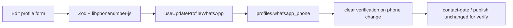

# Implementation plan: Phone verification — increment 1 (entry and validation)

- **Spec:** [spec.md](./spec.md)
- **Status:** Ready
- **Scope:** Increment 1 only. No OTP, Edge Functions, match/community verified gates, or public badges (increment 2).

## Current-state findings

**Verified facts**

- `profiles.whatsapp_phone` exists (nullable, E.164 CHECK). `whatsapp_verified_at` exists but has no writer; [`protect_profile_fields`](../../supabase/migrations/20260830120000_security_hardening.sql) blocks client updates to `whatsapp_verified_at`.
- [`useProfile`](../../src/features/profile/use-profile.ts) already selects `whatsapp_phone` and `whatsapp_verified_at`. There is **no mutation** for WhatsApp today.
- [`app/(app)/edit-profile.tsx`](../../app/(app)/edit-profile.tsx) saves padel category, playing prefs, demographics, and bio only — no WhatsApp field since [`e7d0d74`](../../docs/decisions.md).
- Community publish requires non-null `whatsapp_phone` in DB ([`enforce_community_post_limits`](../../supabase/migrations/20260711010000_create_community_posts.sql)) and in [`useProfileContactGate`](../../src/features/community/use-posts.ts) / create-post UI. **Verification is not required in increment 1.**
- No `libphonenumber-js` in `package.json`. Old onboarding used custom `+54` helpers (removed in `e7d0d74`).
- No trigger clears `whatsapp_verified_at` when `whatsapp_phone` changes today (relevant for increment 2; increment 1 should install the trigger so phone edits do not leave stale verification).

**Assumptions (validate before migration SQL)**

- Hosted DB may contain legacy values like `+5411…` missing the mobile `9`. Run a read-only count/sample on production/staging before finalizing normalization rules (spec assumption).

## Proposed approach

1. **Pure library module** for Argentine WhatsApp numbers: parse national input with `libphonenumber-js` (`defaultCountry: 'AR'`), require **mobile** type, output canonical E.164 (`+549…`), format for display. Export Zod helpers for forms.
2. **Unit tests** for parsing edge cases listed in spec (`0`, `15`, `+54 9`, invalid, landline).
3. **Migration (two concerns in one file or split):**
   - **Data:** `UPDATE profiles SET whatsapp_phone = …` only where a documented, conservative rule applies (e.g. `+54` + area without leading `9` → insert `9` after country code for known mobile patterns). Comment `updated_count` / `skipped_count`.
   - **Trigger:** `BEFORE UPDATE ON profiles` — when `whatsapp_phone` changes, set `NEW.whatsapp_verified_at := NULL`. **Amend `protect_profile_fields`** to allow that nulling when `whatsapp_phone` changed (otherwise the protect trigger rejects the same UPDATE).
4. **Client:** `useUpdateProfileWhatsApp` mutation (update `whatsapp_phone` only; empty string → `null`). Invalidate `['profile', 'me']` and `['profile', 'contact-gate']`.
5. **UI:** WhatsApp section on Edit profile — fixed `+54` prefix label, local digits input (`phone-pad`), optional clear/remove, copy aligned with existing `SectionLabel` / `FieldError` patterns. Extend `editProfileSchema` or a nested field validated via shared Zod pipe.
6. **No increment-2 surfaces** in this increment (no verify sheet, no profile status card, no pill — those ship with OTP).

## Expected changes

| Area | Expected files/systems | Reason |
| --- | --- | --- |
| Client library | `src/lib/argentina-whatsapp-phone.ts` (or `src/features/profile/argentina-whatsapp-phone.ts`) | Parse, validate, format, Zod |
| Client tests | `src/lib/__tests__/argentina-whatsapp-phone.test.ts` | Spec acceptance cases |
| Client data | `src/features/profile/use-profile.ts` | `useUpdateProfileWhatsApp` + cache invalidation |
| Client UI | `app/(app)/edit-profile.tsx` | WhatsApp field + save in `Promise.all` |
| Database | `supabase/migrations/<timestamp>_whatsapp_phone_normalize_and_verification_reset.sql` | Normalize data + trigger + `protect_profile_fields` tweak |
| Generated types | `src/types/database.ts` | Regenerate after migration (developer runs CLI) |
| Dependencies | `package.json` | `libphonenumber-js` via `pnpm add libphonenumber-js` |

**Explicitly not changed in increment 1:** `public_profiles`, match RLS, `enforce_community_post_limits` verified check, `tab-bar`, `match-detail`, OTP/Twilio, `docs/decisions.md` (unless normalization policy becomes a durable decision — optional one-liner only if needed).

## Data, security, and lifecycle

- **RLS:** unchanged — owner updates own `profiles` row; `whatsapp_phone` still not exposed via `public_profiles`.
- **Verification column:** clients must not send `whatsapp_verified_at`. Trigger nulls it on phone change; protect trigger must permit that single case.
- **Cache:** after save, invalidate `['profile', 'me']` and `['profile', 'contact-gate']` so create-post gate sees new number.
- **Empty number:** storing `null` is allowed; publish still blocked by existing rules.
- **Duplicates:** no uniqueness constraint (Q8).

## Risks, dependencies, and open decisions

| Risk / dependency | Mitigation |
| --- | --- |
| `protect_profile_fields` vs verification reset on same UPDATE | Extend protect function to allow `whatsapp_verified_at → null` when `whatsapp_phone` changed |
| Normalization migration wrong for edge cases | Conservative SQL + hosted data sample before merge; skip ambiguous rows |
| Bundle size (`libphonenumber-js`) | Import minimal entry points; use `metadata` subset if needed after measuring |
| Developer must run typegen | Document in tasks: `npx supabase gen types typescript --local > src/types/database.ts` after migration |

## Verification plan

- [ ] `pnpm typecheck`
- [ ] `pnpm lint`
- [ ] `pnpm test` (includes new phone unit tests)
- [ ] Local Supabase: apply migration; confirm normalization comments; UPDATE phone as authenticated user clears `whatsapp_verified_at` when previously set (manual test row)
- [ ] Device/manual: Edit profile save valid AR mobile; create-post proceeds with saved number (unverified OK); remove number blocks publish; match WhatsApp link uses normalized E.164
- [ ] Cross-reference spec §3 scenarios tagged **[Inc 1]**

## Alternatives considered

- **Custom regex only (no libphonenumber-js):** rejected in spec — caused `+54`/`9` bugs.
- **Capture in onboarding or create-post inline:** rejected (Q2) — Edit profile only for increment 1.
- **Server-side RPC for save:** unnecessary — RLS already allows owner UPDATE; validation is client-first with DB CHECK as backstop.
