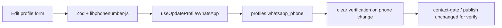
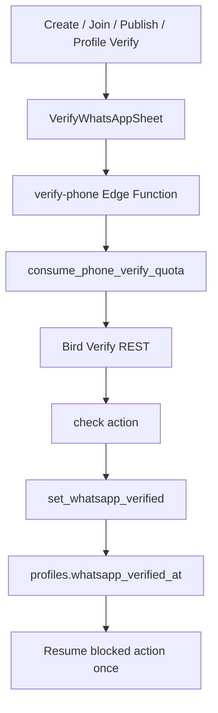

# Implementation plan: Phone verification — increment 1 (entry and validation)

- **Spec:** [spec.md](./spec.md)
- **Status:** Ready
- **Scope:** Increment 1 only. No OTP, Edge Functions, match/community verified gates, or public badges (increment 2).

## Current-state findings

**Verified facts**

- `profiles.whatsapp_phone` exists (nullable, E.164 CHECK). `whatsapp_verified_at` exists but has no writer; [`protect_profile_fields`](../../supabase/migrations/20260830120000_security_hardening.sql) blocks client updates to `whatsapp_verified_at`.
- [`useProfile`](../../src/features/profile/use-profile.ts) already selects `whatsapp_phone` and `whatsapp_verified_at`. There is **no mutation** for WhatsApp today.
- [`app/(app)/edit-profile.tsx`](../../app/(app)/edit-profile.tsx) saves padel category, playing prefs, demographics, and bio only — no WhatsApp field since [`e7d0d74`](../../docs/decisions.md).
- Community publish requires non-null `whatsapp_phone` in DB ([`enforce_community_post_limits`](../../supabase/migrations/20260711010000_create_community_posts.sql)) and in [`useProfileContactGate`](../../src/features/community/use-posts.ts) / create-post UI. **Verification is not required in increment 1.**
- No `libphonenumber-js` in `package.json`. Old onboarding used custom `+54` helpers (removed in `e7d0d74`).
- No trigger clears `whatsapp_verified_at` when `whatsapp_phone` changes today (relevant for increment 2; increment 1 should install the trigger so phone edits do not leave stale verification).

**Assumptions (validate before migration SQL)**

- Hosted DB may contain legacy values like `+5411…` missing the mobile `9`. Run a read-only count/sample on production/staging before finalizing normalization rules (spec assumption).

## Proposed approach

1. **Pure library module** for Argentine WhatsApp numbers: parse national input with `libphonenumber-js` (`defaultCountry: 'AR'`), require **mobile** type, output canonical E.164 (`+549…`), format for display. Export Zod helpers for forms.
2. **Unit tests** for parsing edge cases listed in spec (`0`, `15`, `+54 9`, invalid, landline).
3. **Migration (two concerns in one file or split):**
   - **Data:** `UPDATE profiles SET whatsapp_phone = …` only where a documented, conservative rule applies (e.g. `+54` + area without leading `9` → insert `9` after country code for known mobile patterns). Comment `updated_count` / `skipped_count`.
   - **Trigger:** `BEFORE UPDATE ON profiles` — when `whatsapp_phone` changes, set `NEW.whatsapp_verified_at := NULL`. **Amend `protect_profile_fields`** to allow that nulling when `whatsapp_phone` changed (otherwise the protect trigger rejects the same UPDATE).
4. **Client:** `useUpdateProfileWhatsApp` mutation (update `whatsapp_phone` only; empty string → `null`). Invalidate `['profile', 'me']` and `['profile', 'contact-gate']`.
5. **UI:** WhatsApp section on Edit profile — fixed `+54` prefix label, local digits input (`phone-pad`), optional clear/remove, copy aligned with existing `SectionLabel` / `FieldError` patterns. Extend `editProfileSchema` or a nested field validated via shared Zod pipe.
6. **No increment-2 surfaces** in this increment (no verify sheet, no profile status card, no pill — those ship with OTP).

## Expected changes

| Area | Expected files/systems | Reason |
| --- | --- | --- |
| Client library | `src/lib/argentina-whatsapp-phone.ts` (or `src/features/profile/argentina-whatsapp-phone.ts`) | Parse, validate, format, Zod |
| Client tests | `src/lib/__tests__/argentina-whatsapp-phone.test.ts` | Spec acceptance cases |
| Client data | `src/features/profile/use-profile.ts` | `useUpdateProfileWhatsApp` + cache invalidation |
| Client UI | `app/(app)/edit-profile.tsx` | WhatsApp field + save in `Promise.all` |
| Database | `supabase/migrations/<timestamp>_whatsapp_phone_normalize_and_verification_reset.sql` | Normalize data + trigger + `protect_profile_fields` tweak |
| Generated types | `src/types/database.ts` | Regenerate after migration (developer runs CLI) |
| Dependencies | `package.json` | `libphonenumber-js` via `pnpm add libphonenumber-js` |

**Explicitly not changed in increment 1:** `public_profiles`, match RLS, `enforce_community_post_limits` verified check, `tab-bar`, `match-detail`, OTP/Twilio, `docs/decisions.md` (unless normalization policy becomes a durable decision — optional one-liner only if needed).

## Data, security, and lifecycle

- **RLS:** unchanged — owner updates own `profiles` row; `whatsapp_phone` still not exposed via `public_profiles`.
- **Verification column:** clients must not send `whatsapp_verified_at`. Trigger nulls it on phone change; protect trigger must permit that single case.
- **Cache:** after save, invalidate `['profile', 'me']` and `['profile', 'contact-gate']` so create-post gate sees new number.
- **Empty number:** storing `null` is allowed; publish still blocked by existing rules.
- **Duplicates:** no uniqueness constraint (Q8).

## Risks, dependencies, and open decisions

| Risk / dependency | Mitigation |
| --- | --- |
| `protect_profile_fields` vs verification reset on same UPDATE | Extend protect function to allow `whatsapp_verified_at → null` when `whatsapp_phone` changed |
| Normalization migration wrong for edge cases | Conservative SQL + hosted data sample before merge; skip ambiguous rows |
| Bundle size (`libphonenumber-js`) | Import minimal entry points; use `metadata` subset if needed after measuring |
| Developer must run typegen | Document in tasks: `npx supabase gen types typescript --local > src/types/database.ts` after migration |

## Verification plan

- [ ] `pnpm typecheck`
- [ ] `pnpm lint`
- [ ] `pnpm test` (includes new phone unit tests)
- [ ] Local Supabase: apply migration; confirm normalization comments; UPDATE phone as authenticated user clears `whatsapp_verified_at` when previously set (manual test row)
- [ ] Device/manual: Edit profile save valid AR mobile; create-post proceeds with saved number (unverified OK); remove number blocks publish; match WhatsApp link uses normalized E.164
- [ ] Cross-reference spec §3 scenarios tagged **[Inc 1]**

## Alternatives considered

- **Custom regex only (no libphonenumber-js):** rejected in spec — caused `+54`/`9` bugs.
- **Capture in onboarding or create-post inline:** rejected (Q2) — Edit profile only for increment 1.
- **Server-side RPC for save:** unnecessary — RLS already allows owner UPDATE; validation is client-first with DB CHECK as backstop.

---

# Implementation plan: Phone verification — increment 2 (OTP, gates, badges)

- **Spec:** [spec.md](./spec.md) (decisions Q9–Q11, Q14–Q15 resolved 2026-10-04)
- **Status:** Ready
- **Scope:** Bird Verify via `verify-phone`, verified-required gates (match create/join, community publish), full-screen verify flow + resume, Profile/public badges, legal + architecture docs. **Depends on increment 1** (Argentine capture, normalization trigger, `libphonenumber-js`).

## Current-state findings (increment 2 touchpoints)

**Verified facts**

- **Quota pattern:** [`20260730120000_places_search_rate_limit.sql`](../../supabase/migrations/20260730120000_places_search_rate_limit.sql) — append-only rate table, RLS deny-all for clients, `consume_places_search_quota()` SECURITY DEFINER called from Edge Function.
- **Edge Function pattern:** [`supabase/functions/places-search/index.ts`](../../supabase/functions/places-search/index.ts) — CORS, JWT via `createClient` + `auth.getUser()`, RPC quota before external API, generic errors (no secret leakage).
- **Match gates:** [`20260830190000_ban_enforcement_and_moderation_refinement.sql`](../../supabase/migrations/20260830190000_ban_enforcement_and_moderation_refinement.sql) — policy `"Authenticated users can host matches"` (`host_id = auth.uid() and not is_banned()`); `validate_match_participant_insert()` (ban + block checks only today).
- **Community gate:** [`20260711010000_create_community_posts.sql`](../../supabase/migrations/20260711010000_create_community_posts.sql) — `enforce_community_post_limits()` requires non-null `whatsapp_phone`, snapshots `contact_verified_at` from profile; **no verified check yet**.
- **`public_profiles`:** Latest rebuild in [`20260920100000_profile_demographics.sql`](../../supabase/migrations/20260920100000_profile_demographics.sql) (drop/create view). No `whatsapp_verified` column yet.
- **Verification writer:** `whatsapp_verified_at` still client-protected by `protect_profile_fields()`; increment 1 trigger clears it on phone change ([`20261004160000_whatsapp_phone_normalize_and_verification_reset.sql`](../../supabase/migrations/20261004160000_whatsapp_phone_normalize_and_verification_reset.sql)). Internal updates use `padelcito.profile_internal_update` ([`20260830120000_security_hardening.sql`](../../supabase/migrations/20260830120000_security_hardening.sql)).
- **Client gates (phone only):** [`useProfileContactGate`](../../src/features/community/use-posts.ts) returns `whatsappPhone` only; [`create-post-form.tsx`](../../src/features/community/create-post/create-post-form.tsx) uses `AppBottomSheet` for missing number.
- **Action entry points (no verify yet):** center FAB → `create-match` in [`src/components/tab-bar.tsx`](../../src/components/tab-bar.tsx); join flow in [`app/(app)/match-detail.tsx`](../../app/(app)/match-detail.tsx) (`useRequestToJoin`); Profile / Edit profile / [`player-profile.tsx`](../../app/(app)/player-profile.tsx) and roster rows (badge TBD).

**Assumptions**

- Increment 1 migration and Edit profile WhatsApp field are merged/applied locally before increment 2 DB work.
- Bird wallet/API key until manual setup (Q15); local stack uses dev mode below for E2E without sends.

## Proposed approach

1. **Migration — quotas:** `phone_verify_quota` (or split user-window + per-number daily tables) with RLS deny-all; `consume_phone_verify_quota(p_phone_hash text)` — **5 sends / 10 min / user**, **10 sends / day / number** (hash only, e.g. SHA-256 of E.164 + server pepper via DB secret or fixed app salt documented in migration comment).
2. **Migration — verification RPC:** `set_whatsapp_verified(p_phone text)` SECURITY DEFINER: assert JWT user; `not is_banned()`; validate E.164 AR mobile (reuse CHECK or helper); **phone must match** current `profiles.whatsapp_phone` for caller; set `padelcito.profile_internal_update`; set `whatsapp_verified_at := now()` (and optionally align phone if RPC accepts normalized input).
3. **Migration — helpers and gates:** `has_verified_whatsapp()` SECURITY DEFINER (same pattern as `is_banned()`); extend `"Authenticated users can host matches"` with `has_verified_whatsapp()`; extend `validate_match_participant_insert()` for joining `profile_id` when not host self-insert; extend `enforce_community_post_limits()` to require `whatsapp_verified_at is not null` with clear exception message.
4. **Migration — public surface:** Rebuild `public_profiles` adding `whatsapp_verified boolean` (`whatsapp_verified_at is not null`) — **not** phone or timestamp.
5. **Edge Function `verify-phone`:** Actions `start` and `check`. JWT + ban check; server-side format validation; call `consume_phone_verify_quota` before Bird send; Bird Verify REST (`POST /v1/verify/verifications` with `channels: ["whatsapp"]`, `check`) with **10s fetch timeout**. `start` supports `resend`. On successful `check`, call `set_whatsapp_verified` via authenticated RPC using user's JWT.
6. **Local dev mode (Q15):** Env `VERIFY_PHONE_DEV_MODE=true` **only** when running against **local** Supabase. `start` returns success without Bird; `check` accepts **`000000`** only. Refuse dev mode if URL looks hosted. Document in `docs/phone-verification-setup.md` — **never** set flag in hosted secrets.
7. **Client:** `use-phone-verification.ts` (TanStack mutations → Edge Function); shared `VerifyWhatsAppSheet` (`AppBottomSheet`) with optional number entry (reuse `argentina-whatsapp-phone` Zod); `useRequireVerifiedWhatsApp({ onVerified })` for gates with **resume once** semantics.
8. **Wire gates:** tab-bar FAB → verify then navigate `create-match`; match-detail join; create-post submit; Profile status card + Edit profile pill.
9. **Badges:** Profile identity check badge; player profile + roster **Verified** when `public_profiles.whatsapp_verified`.
10. **Docs:** Q10 legal; Q11 `docs/decisions.md` + `ai-architecture-context.md`; setup guide for Bird API key, Argentina countries, wallet, `BIRD_API_KEY` / `BIRD_API_HOST`.

## Expected changes

| Area | Expected files/systems | Reason |
| --- | --- | --- |
| Database | `supabase/migrations/<timestamp>_phone_verify_quota_and_gates.sql` (name TBD) | Quota, RPCs, gates, `public_profiles` |
| Edge Function | `supabase/functions/verify-phone/index.ts` | Bird proxy + dev mode |
| Client hooks | `src/features/profile/use-phone-verification.ts`, `use-require-verified-whatsapp.ts` | OTP + gate helper |
| Client UI | `src/features/profile/verify-whatsapp-sheet.tsx` (or similar) | Shared sheet |
| Client wiring | `tab-bar.tsx`, `match-detail.tsx`, `create-post-form.tsx`, `profile.tsx`, `edit-profile.tsx`, roster/player profile components | Gates + badges |
| Community | `use-posts.ts` (`useProfileContactGate` adds verified flag) | Client mirror of DB gate |
| Docs | `docs/phone-verification-setup.md`, `docs/legal/*`, `docs/decisions.md`, `ai-architecture-context.md` | Q10, Q11, ops |
| Generated types | `src/types/database.ts` | After migration (developer CLI) |
| Tests | Unit tests for phone hash/quota helpers if extracted; existing `argentina-whatsapp-phone` unchanged | Regression |

**Explicitly not changed:** Auth providers; onboarding; `match_contact_details()` contract; uniqueness of phone numbers (Q8); retroactive revocation of existing match participations.

## Data, security, and lifecycle

- **RLS:** Quota tables remain invisible to clients; only SECURITY DEFINER RPCs + Edge Function (service/ user JWT) consume quota.
- **Secrets:** `BIRD_API_KEY`, `BIRD_API_HOST` — Supabase Edge secrets only.
- **Logging:** No plaintext phone in logs or analytics; quota uses hash; aggregate metrics by channel/outcome only (spec §6).
- **Banned users:** Cannot pass verify flow or set verification; gates still respect `is_banned()`.
- **Phone change:** Increment 1 trigger clears verification; gates re-apply until user re-verifies.
- **Rollout (Q14):** Immediate DB enforcement; Profile card is the sole proactive prompt (no first-launch modal).

## Risks, dependencies, and mitigations

| Risk / dependency | Mitigation |
| --- | --- |
| No Bird wallet (Q15) | Local dev mode; setup doc; real channel test after wallet top-up |
| Dev mode enabled in production | Hard guard on `SUPABASE_URL`; code review + setup doc warning |
| `protect_profile_fields` vs RPC | `set_whatsapp_verified` sets `padelcito.profile_internal_update` |
| Per-number quota without storing phone | Hash E.164 with documented algorithm; never store plaintext in quota table |
| Client/server format drift | Share validation rules; reject before quota/Bird |
| Bundle / UX | Single sheet; OTP autofill where supported |

## Verification plan

- [ ] `pnpm typecheck`, `pnpm lint`, `pnpm test`
- [ ] Local Supabase: migration up; RPC `set_whatsapp_verified` rejects wrong user/phone; direct client UPDATE of `whatsapp_verified_at` fails; SQL insert match/join/post without verify fails
- [ ] Local dev mode: `start`/`check` with `000000` sets verified; gates resume
- [ ] With Bird wallet: WhatsApp and SMS fallback; Argentina country enabled
- [ ] Two-device manual: public badge on player profile/roster; Profile card hides after verify; publish shows Verified contact when snapshot set
- [ ] Spec §3 scenarios tagged **[Inc 2]**

## Alternatives considered

- **Defer match gates to client-only:** rejected — spec requires RLS + trigger enforcement.
- **Fourth Edge Function for business logic:** rejected — verification completion stays in Postgres RPC (Q11 proxy-only EF).
- **Skip dev mode and mock Twilio in tests only:** rejected for Q15 — developers need full stack without billing account.
