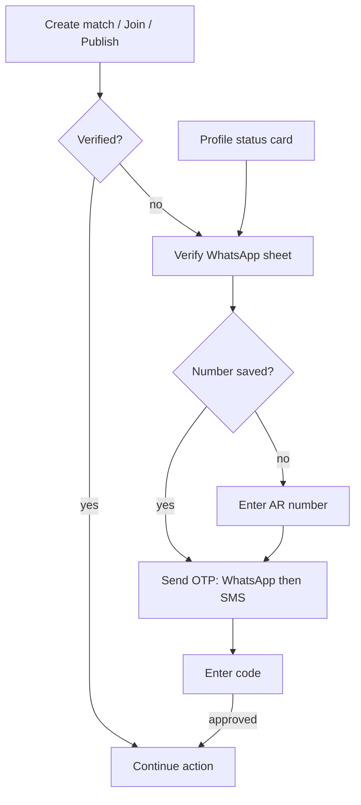

# Feature specification: Phone number validation and verification

- **Status:** Ready for plan
- **Owner/date:** 2026-10-04 (updated 2026-10-04 — match gating + profile/public badges)
- **Delivery:** Two increments under this spec (increment 1: entry and validation; increment 2: OTP ownership verification, verified-required publishing, match create/join gating, and verification UX badges).
- **Related docs/code:**
  - Schema: [`20260608050054_0001_initial_schema.sql`](../../supabase/migrations/20260608050054_0001_initial_schema.sql) (`profiles.whatsapp_phone`), [`20260711000000_add_user_role.sql`](../../supabase/migrations/20260711000000_add_user_role.sql) (`whatsapp_verified_at`), [`20260711010000_create_community_posts.sql`](../../supabase/migrations/20260711010000_create_community_posts.sql) (`contact_phone` snapshot), [`20260830120000_security_hardening.sql`](../../supabase/migrations/20260830120000_security_hardening.sql) (`protect_profile_fields`), [`20260830130000_user_blocks_and_account_deletion.sql`](../../supabase/migrations/20260830130000_user_blocks_and_account_deletion.sql) (current `match_contact_details`), [`20260830190000_ban_enforcement_and_moderation_refinement.sql`](../../supabase/migrations/20260830190000_ban_enforcement_and_moderation_refinement.sql) (`matches` insert policy, `validate_match_participant_insert`), [`20260920100000_profile_demographics.sql`](../../supabase/migrations/20260920100000_profile_demographics.sql) (`public_profiles` rebuild pattern)
  - Client: [`src/features/profile/use-profile.ts`](../../src/features/profile/use-profile.ts), [`app/(app)/edit-profile.tsx`](<../../app/(app)/edit-profile.tsx>), [`app/(app)/profile.tsx`](<../../app/(app)/profile.tsx>), [`app/(app)/player-profile.tsx`](<../../app/(app)/player-profile.tsx>), [`src/components/tab-bar.tsx`](../../src/components/tab-bar.tsx), [`src/features/community/use-posts.ts`](../../src/features/community/use-posts.ts) (`useProfileContactGate`), [`src/features/community/create-post/create-post-form.tsx`](../../src/features/community/create-post/create-post-form.tsx), [`app/(app)/match-detail.tsx`](<../../app/(app)/match-detail.tsx>), [`src/features/matches/match-whatsapp.ts`](../../src/features/matches/match-whatsapp.ts), [`src/features/community/post-whatsapp.ts`](../../src/features/community/post-whatsapp.ts), [`src/features/community/post-display.ts`](../../src/features/community/post-display.ts)
  - Prior research: Cursor plan `phone_verification_(otp)_544ef406.plan.md` (2026-08-07), reviewed in section 8

## 1. User problem and outcome

Players reach each other only through WhatsApp: a `wa.me` link to the host or to accepted players in a match, and a public contact on approved community posts. The app has three phone-number problems today:

1. **Players cannot add a number.** Commit `e7d0d74` (2026-10-04) removed the WhatsApp field from onboarding, and no other screen writes `profiles.whatsapp_phone`. New users can't publish community posts (both the client gate and the DB trigger require the number), and match contact shows "This player has not added a WhatsApp number yet."
2. **Validation is weak.** The only rule is the E.164 shape regex `^\+[1-9][0-9]{6,14}$` in the DB. It accepts numbers that are well formed but don't exist, aren't mobile, or are written in a form `wa.me` can't open (for example, an Argentine mobile without the `9` after `+54`).
3. **Ownership is never proven.** `whatsapp_verified_at` and `community_posts.contact_verified_at` exist, and the "Verified contact" badge is already rendered, but nothing can set the column. Anyone can enter someone else's number, and that number then becomes public on approved posts.

**Outcome:** a player can add or change one Argentine WhatsApp number from Edit profile. The number is normalized and validated before it is saved. After increment 2, the player proves ownership via OTP. A **verified number is required to publish community posts, create a match, and request to join a match.** The player sees verification status on Profile and can verify in one tap (status card or action gates). Other players see a **Verified** badge on public profiles and match rosters (boolean only — never the phone number). Contact links open the correct WhatsApp chat.

## 2. Scope

### Increment 1 — Entry and validation

- Add, change, and remove `profiles.whatsapp_phone` in [`app/(app)/edit-profile.tsx`](<../../app/(app)/edit-profile.tsx>) only. Not in onboarding, not an inline create-post prompt.
- **Argentina only:** fixed `+54` country context; any number that does not normalize to a valid Argentine mobile E.164 (`+549…`) is rejected with a clear message.
- **`libphonenumber-js`:** parse common national forms (`0`, `15`, `+54 9`, spaces/dashes) into canonical E.164; reject invalid, non-mobile, or non-Argentine input before save.
- **Migration:** normalize existing `profiles.whatsapp_phone` values where the rewrite to `+549…` is unambiguous; leave others untouched and document counts in migration comments.
- **DB guard:** when `whatsapp_phone` changes, clear `whatsapp_verified_at` (trigger), compatible with `protect_profile_fields`.
- **Community gate (increment 1):** publishing requires a **valid saved number** (same as today: not null, passes validation). Verification is not required until increment 2.

### Increment 2 — Ownership verification, gating, and badges

- **Bird Verify** via Edge Function `verify-phone` (integration proxy holding Bird API secrets). **WhatsApp-only** OTP for MVP (SMS fallback deferred — see decisions 2026-10-05).
- **SECURITY DEFINER RPC** (e.g. `set_whatsapp_verified`) sets `padelcito.profile_internal_update` then updates `whatsapp_phone` (if needed) and `whatsapp_verified_at`; client cannot set verification directly.
- **Server quotas** via `consume_phone_verify_quota()` per Q9 (per-user window + per-number daily cap on hashed number).
- **Helper `has_verified_whatsapp()`** (SECURITY DEFINER, `is_banned()` pattern): true when caller's profile has non-null `whatsapp_verified_at` (and optionally non-null `whatsapp_phone`).
- **Match gating:** hosting blocked unless verified — extend RLS policy `"Authenticated users can host matches"` (`host_id = auth.uid() and not is_banned()`) with `has_verified_whatsapp()`. Join requests blocked in `validate_match_participant_insert()` for the joining user. Existing matches and roster rows are not retroactively revoked.
- **Community gate:** publishing requires **`whatsapp_verified_at` not null** — enforced in `enforce_community_post_limits()` and mirrored in `useProfileContactGate` and create-post UI.
- **One shared verify flow:** a single **Verify your WhatsApp** sheet (`AppBottomSheet`) launched from every gate: create-match tab (`tab-bar.tsx`), join on `match-detail.tsx`, create-post gate, and Profile status card. If no number, collect AR-validated input in-sheet; send OTP (WhatsApp → SMS); on success **resume the blocked action once** without forcing the user to navigate away and back.
- **Owner badge and prompt (Profile):**
  - Verified: check badge adjacent to name in `ProfileIdentityCard` on [`app/(app)/profile.tsx`](<../../app/(app)/profile.tsx>).
  - Not verified: compact status card under identity ("Verify your WhatsApp to play and publish" + **Verify** button), or "Add and verify WhatsApp" when no number; opens shared sheet (prefill when number exists).
  - Edit profile: WhatsApp field shows **Verified** or **Not verified · Verify** pill opening the same sheet.
- **Public badge:** **Verified** on [`app/(app)/player-profile.tsx`](<../../app/(app)/player-profile.tsx>) and match roster rows when the player is verified. Backed by boolean **`whatsapp_verified`** on `public_profiles` (`whatsapp_verified_at is not null`). Never expose phone or timestamp on the view.
- **Community posts:** existing "Verified contact" badge on approved posts continues via `contact_verified_at` snapshot.

### Out of scope

- Phone-based sign-in, or replacing email OTP or Google auth.
- Phone entry in onboarding, dedicated-only screens (unless added later by plan), or non-Argentine numbers at launch.
- Uniqueness of numbers across profiles (duplicates allowed, including verified).
- New exposure of `whatsapp_phone`. `match_contact_details()` and public `contact_phone` on approved posts remain the only paths to the actual number.
- Group WhatsApp CTAs or changes to 1:1 contact rules.
- Rewriting `contact_phone` or `contact_verified_at` on existing community posts (publish-time snapshots).
- In-app chat (`conversations` / `messages` stay dormant).

## 3. User scenarios and acceptance criteria

### Scenario: Add a valid Argentine number [Inc 1]

Given a signed-in player with no WhatsApp number, when they open Edit profile, enter a valid Argentine mobile in a common national format, and save, then the number is stored as canonical E.164 (`+549…`) and displayed in a readable national format.

- [ ] [Inc 1] Input such as `11 2345-6789`, `011 15 2345-6789`, or `+54 9 11 2345 6789` is stored as `+5491123456789`, and `wa.me` opens correctly.
- [ ] [Inc 1] Invalid, too short/long, non-mobile, or non-Argentine numbers are rejected inline with a specific message; nothing is saved.
- [ ] [Inc 1] The DB still rejects values that fail the E.164 CHECK if the client is bypassed.
- [ ] [Inc 1] Save shows loading and error states; RLS or network errors are user-visible.

### Scenario: Normalize existing profile numbers [Inc 1]

Given profiles with legacy `whatsapp_phone` values from the old onboarding input, when the normalization migration runs, then safely fixable values become `+549…` and the rest are unchanged.

- [ ] [Inc 1] A stored `+54` mobile missing the mobile `9` is rewritten to `+549…` when unambiguous.
- [ ] [Inc 1] Values that cannot be safely normalized are left untouched; migration comments report how many were updated vs skipped.

### Scenario: Change or remove a number [Inc 1]

Given a player with a saved number (verified or not), when they change or remove it in Edit profile, then verification is cleared and caches refresh.

- [ ] [Inc 1] Any change to `whatsapp_phone` sets `whatsapp_verified_at = null` in the DB, not only on the client.
- [ ] [Inc 1] Removing the number is allowed; publishing is blocked with the existing "add your WhatsApp" message (increment 1 gate).
- [ ] [Inc 1] Profile and contact-gate queries refresh after save.

### Scenario: Same number on multiple profiles [Inc 1–2]

Given two different accounts, when each saves the same E.164 number and (after increment 2) each completes verification, then both succeed without uniqueness errors.

- [ ] [Inc 1] Two profiles may store the same `whatsapp_phone`.
- [ ] [Inc 2] Two profiles may both have `whatsapp_verified_at` set for the same number.

### Scenario: Verify ownership [Inc 2]

Given a player with a saved, unverified number, when they request a code (WhatsApp first, SMS fallback), enter it correctly, then the number is marked verified via the trusted server path only.

- [ ] [Inc 2] Direct client updates to `whatsapp_verified_at` fail (`protect_profile_fields`).
- [ ] [Inc 2] Verification succeeds only if the verified number matches the profile's current `whatsapp_phone`.
- [ ] [Inc 2] Wrong, expired, or over-limit codes show clear errors; number stays unverified.
- [ ] [Inc 2] Resend cooldown in UI; per-user (and per-number, if implemented) limits enforced server-side.
- [ ] [Inc 2] ~~WhatsApp delivery failure offers SMS fallback~~ **Deferred** — WhatsApp-only MVP (2026-10-05).
- [ ] [Inc 2] Unauthenticated or banned users cannot start verification.

### Scenario: Host a match [Inc 2]

Given an unverified signed-in player, when they tap the create-match entry point (tab bar), then the verify sheet opens; after successful verification, create-match flow proceeds.

- [ ] [Inc 2] Direct `matches` insert without verification is rejected by RLS; client surfaces a permission-style message.
- [ ] [Inc 2] Banned users remain blocked regardless of verification (`is_banned()` unchanged).

### Scenario: Request to join a match [Inc 2]

Given an unverified player viewing an open match, when they tap join/request, then the verify sheet opens; after success, the join request is submitted.

- [ ] [Inc 2] Direct `match_participants` insert for a join without verification is rejected by `validate_match_participant_insert()`.
- [ ] [Inc 2] Existing pending or accepted participations are not revoked when increment 2 ships.

### Scenario: Publish community post [Inc 1 vs Inc 2]

Given a player attempting to publish a community post:

- [ ] [Inc 1] With a valid saved number and `whatsapp_verified_at` null, publish is **allowed** (same as today except number must be valid/normalized).
- [ ] [Inc 2] With a valid saved number but `whatsapp_verified_at` null, publish is **blocked** in app and DB with a message to verify WhatsApp (verify sheet with resume).
- [ ] [Inc 2] With no number, publish remains blocked with "add your WhatsApp" messaging.
- [ ] [Inc 2] With verified number, publish succeeds; approved posts snapshot `contact_verified_at` and show "Verified contact" when non-null.
- [ ] [Inc 1–2] Already-published posts keep their existing `contact_phone` / `contact_verified_at` snapshots.

### Scenario: Profile verification prompt and owner badge [Inc 2]

Given the signed-in player on Profile:

- [ ] [Inc 2] When not verified, a status card appears with one-tap **Verify** (or add+verify copy when no number); card hides after verification with cache refresh.
- [ ] [Inc 2] When verified, a check badge appears next to the display name on Profile.
- [ ] [Inc 2] Changing the number clears verification, removes the name badge, and shows the status card again.
- [ ] [Inc 2] Edit profile shows Verified / Not verified · Verify pill consistent with Profile state.

### Scenario: Public Verified badge [Inc 2]

Given another player viewing a verified user's public profile or match roster:

- [ ] [Inc 2] **Verified** badge visible when `public_profiles.whatsapp_verified` is true; no badge when false (no negative "unverified" label to others).
- [ ] [Inc 2] `public_profiles` exposes only the boolean — not `whatsapp_phone` or `whatsapp_verified_at`.

### Scenario: Resume after verify [Inc 2]

Given a player blocked mid-action by the verify gate:

- [ ] [Inc 2] Dismissing the sheet without completing leaves them on the same screen with no side effects.
- [ ] [Inc 2] Successful verification automatically continues the original action exactly once (create match navigation, join mutation, or publish submit).

### Scenario: Verified contact on posts and privacy [Inc 2]

- [ ] [Inc 2] Other users never see `whatsapp_phone` except via `match_contact_details()` or approved post `contact_phone`.
- [ ] [Inc 2] Unverified authors' approved posts (legacy snapshots) do not show "Verified contact" if snapshot `contact_verified_at` is null.

### Scenario: Contact with no number [Inc 1–2]

Given a match member whose counterpart has no number, when they tap WhatsApp, the existing "has not added a WhatsApp number" message appears (unchanged).

## 4. Constraints and existing contracts

- **Single source:** `profiles.whatsapp_phone` (nullable text, E.164 CHECK). Only the owner reads their row (RLS). Others reach numbers only through `match_contact_details()` (1:1, active match, blocks). See [`ai-architecture-context.md`](../../ai-architecture-context.md) section 3 and do-not-regress items 2, 3, and 11.
- **Community snapshot:** `enforce_community_post_limits()` requires a profile number today; increment 2 adds verified requirement. Insert copies `whatsapp_phone` and `whatsapp_verified_at` to `contact_phone` / `contact_verified_at`. Updates freeze snapshots via `protect_community_post_fields()`.
- **Match enforcement (increment 2):** `"Authenticated users can host matches"` insert policy on `public.matches`; `validate_match_participant_insert()` before insert on `match_participants`. Both must call `has_verified_whatsapp()` for the acting user (joiner on insert).
- **Privileged column:** `protect_profile_fields()` blocks client writes to `whatsapp_verified_at` unless `padelcito.profile_internal_update` is set.
- **`public_profiles` (increment 2):** add `whatsapp_verified boolean` derived from verification timestamp. Requires security review per do-not-regress item 3; rebuild view with drop/create pattern as in [`20260920100000_profile_demographics.sql`](../../supabase/migrations/20260920100000_profile_demographics.sql).
- **Link building:** `post-whatsapp.ts` and `match_contact_details()` need correctly normalized `+549…` E.164.
- **Backend surface:** Today `places-search` and `push` are integration-proxy Edge Functions. Increment 2 adds `verify-phone`; requires Q11 decision record before implementation (see section 5).
- **Workflow:** migrations via `supabase migration new`; regenerate `src/types/database.ts`. TypeScript strict, pnpm, Expo SDK 56. Prefer `AppBottomSheet` / `AppAlertDialog`.
- **Auth SMS:** disabled in [`supabase/config.toml`](../../supabase/config.toml); increment 2 does not use Supabase Auth `phone_change` as the primary path.

## 5. Decisions, open questions, and assumptions

### Decisions (resolved 2026-10-04)

| ID | Decision |
| --- | --- |
| Q1 | **Two increments:** (1) entry + AR validation + normalization; (2) OTP + verified-required gates + badge UX. |
| Q2 | **Capture in Edit profile only** — not onboarding, not inline create-post. |
| Q3 | **Verified number required** to publish community posts, **create matches, and request to join matches** — enforced in increment 2. |
| Q4 / Q5 | **Bird Verify** via Edge Function `verify-phone`; **WhatsApp-only** for MVP (2026-10-05). |
| Q6 | **Argentina only** at launch (`+54` / `+549…` mobile). |
| Q7 | **Normalize existing values in a migration** where safely detectable; leave ambiguous rows untouched. |
| Q8 | **Allow duplicate numbers** across profiles, including multiple verified profiles on the same number. |
| Q12 | **Gate both match create and join** (not create-only). |
| Q13 | **Owner:** status card + name badge + Edit profile pill; **public:** `whatsapp_verified` boolean on `public_profiles`, badge on player profile and roster — never the phone number. |
| Q9 | **Abuse limits (2026-10-04):** 5 OTP sends per 10 minutes per user; **10 sends per calendar day per number** (counter keyed by **hash of E.164**, never plaintext). Bird **Countries: Argentina only**. Cost scales with active players (≈ **$0.03** list WhatsApp OTP in AR on Bird vs higher Twilio list — recheck at launch; Bird SMS AR rate may require sales quote). |
| Q10 | **Legal (2026-10-04):** Update [`docs/legal/privacy-policy.md`](../../docs/legal/privacy-policy.md) and [`docs/legal/account-deletion.md`](../../docs/legal/account-deletion.md) for **Bird** (and Meta WhatsApp channel) as processors. On account deletion the app deletes our data; **Bird-side retention follows Bird's policy** and the legal docs say so. |
| Q11 | **Edge Function exception (2026-10-04):** `verify-phone` is approved as the **third integration-proxy** Edge Function (Bird API secrets only; no business logic beyond validation, quota, and Verify REST). Record in [`docs/decisions.md`](../../docs/decisions.md) and [`ai-architecture-context.md`](../../ai-architecture-context.md) (section 4 exception list and do-not-regress item 6). |
| Q14 | **Rollout (2026-10-04):** **Enforce immediately** — no grace period. There are **no real users yet**; existing test accounts may be deleted. **Profile status card only** for prompting; **no** one-time in-app notice on first launch after release. |
| Q15 | **Provider (2026-10-04, updated):** **Bird Verify** with funded wallet for live OTP; **local dev mode** on `verify-phone` for stack E2E without sends (see [plan.md](./plan.md) § Increment 2). |

### Open questions

None — increment 2 plan and tasks may proceed.

### Assumptions

- Normalization migration rules were validated against hosted/read-only data before increment 1 migration SQL (row counts, non-`+549` patterns).
- No profile has `whatsapp_verified_at` set today because no writer exists (confirm on hosted data before increment 2 ships).
- Until Bird is configured on hosted projects, developers use **local-only** `VERIFY_PHONE_DEV_MODE` (never in hosted secrets) to exercise the client and RPC path.

## 6. Non-functional requirements

- **Privacy/security:** numbers not logged or sent to analytics; provider secrets in Supabase only; JWT on verify endpoints; rate limits; banned users cannot verify. Increment 2: no OTP send without prior format validation and quota check.
- **Cost:** paid OTP sends only after validation + quota (increment 2). Budget planning uses **active player count × per-verification list cost** (see Q9). Bird bills each send; code check is free.
- **Accessibility:** phone-pad keyboard; labeled fields; errors not color-only; OTP autofill where supported. Verification badge has accessible name **WhatsApp verified**; Profile status card is screen-reader reachable.
- **Performance:** increment 1 validation on-device; `libphonenumber-js` bundle size reviewed (prefer minimal metadata build).
- **Offline:** save/verify require network; no silent paid retries.
- **Compatibility:** Expo SDK 56; no new native module required for `libphonenumber-js`.
- **Observability:** aggregate send/verify success/failure by channel without logging phone numbers.

## 7. Acceptance and verification summary

- **Automated:** `pnpm typecheck`, `pnpm lint`, `pnpm test`. Unit tests for Argentine parsing/normalization (`0`, `15`, `+54 9`; invalid/non-mobile). No root CI workflow in repo.
- **Manual/backend [Inc 1]:** Edit profile save/clear; migration spot-check; `whatsapp_verified_at` clears on number change; publish with valid unverified number still works.
- **Manual/backend [Inc 2]:** OTP WhatsApp/SMS sandbox; direct `whatsapp_verified_at` update fails; publish blocked until verified; **unverified host blocked from create-match then resumes after verify**; **unverified joiner blocked then resumes**; public badge visible on second device; direct SQL insert rejected for `matches` and join `match_participants`; badge on approved posts; `match_contact_details()` unchanged.
- **Risks/rollout:** Bird wallet + Argentina country enablement (Q15); shared sender branding; legal doc updates (Q10) and architecture doc update (Q11); immediate enforcement (Q14); provider cost from first live send; dev mode must not ship enabled on hosted projects.

## 8. Review of the prior plan and alternatives

The 2026-08-07 plan recommended managed Verify behind `verify-phone`, WhatsApp primary and SMS fallback. **2026-10-04:** provider is **Bird Verify** (was Twilio). Core reasoning still holds: contact numbers must not become auth identities, and Supabase `updateUser({ phone })` is SMS-only for phone change.

| Plan premise | Current state | Impact |
| --- | --- | --- |
| Replace Argentina helpers in `use-onboarding-profile.ts` | Field removed in `e7d0d74`; capture goes to Edit profile | Increment 1 restores capture in new location |
| Only `places-search` Edge Function | `push` added as second proxy | Precedent exists; Q11 records third for `verify-phone` |
| RPC sets `whatsapp_verified_at` | `protect_profile_fields()` requires internal flag | RPC must set `padelcito.profile_internal_update` |
| Verified badge UI | Community post badge exists; product added owner + public badges | Shared verify sheet + Profile card + `public_profiles.whatsapp_verified` |
| Single big delivery | Product chose two increments | Spec split accordingly |
| Publish-only verified gate | Product expanded to match create/join | Q3, Q12, match RLS + participant trigger |

### Format validation (increment 1) — chosen

- **`libphonenumber-js`:** chosen for Argentine mobile parsing and E.164 output without a native module.
- **Custom regex-only:** rejected; caused the `+54` / `9` gap described in section 1.

### Ownership verification (increment 2) — chosen

- **A. Bird Verify + Edge Function `verify-phone`:** **chosen** (Q4/Q5, 2026-10-04 switch from Twilio). Managed OTP, WhatsApp then SMS via shared sender, ~$0.03/list WhatsApp OTP estimate in AR (recheck pricing at launch). Requires Q11 exception.

### Considered and rejected (fallbacks if cost/volume changes)

- **B. Supabase Auth `phone_change` + Send SMS Hook:** rejected because `auth.users.phone` is unique, conflicting with Q8 (shared numbers). Still needs outbound secrets and backend surface.
- **C. WhatsApp Cloud API direct + custom OTP storage:** rejected for MVP build/compliance cost; revisit at high volume (~$0.026/msg AR auth template only).
- **D. Reverse OTP (user messages business WhatsApp):** rejected for unfamiliar UX and inbound webhook work; credible if WhatsApp-only cost optimization is needed later.

**Next artifact:** [plan.md](./plan.md) and [tasks.md](./tasks.md) cover **increment 1** (implemented) and **increment 2** (ready to implement per tasks T11+).
